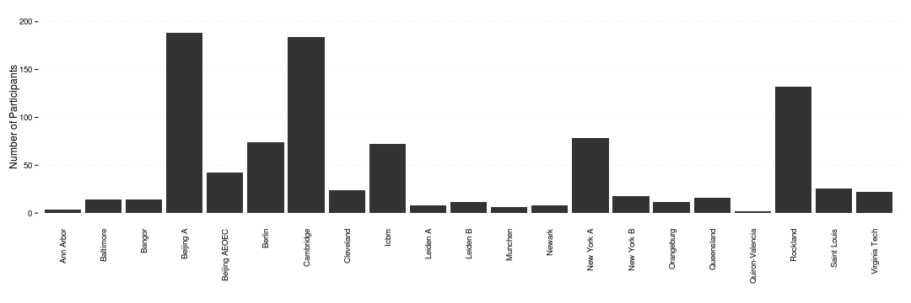
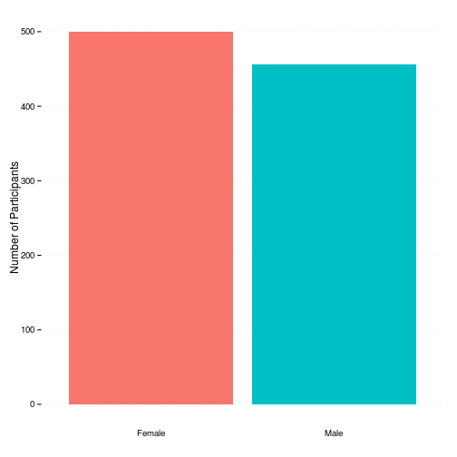
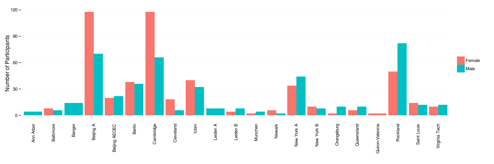
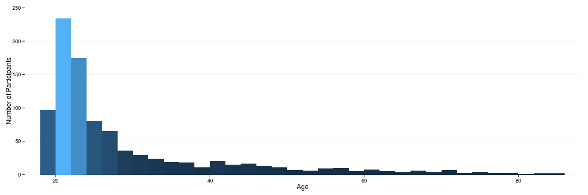
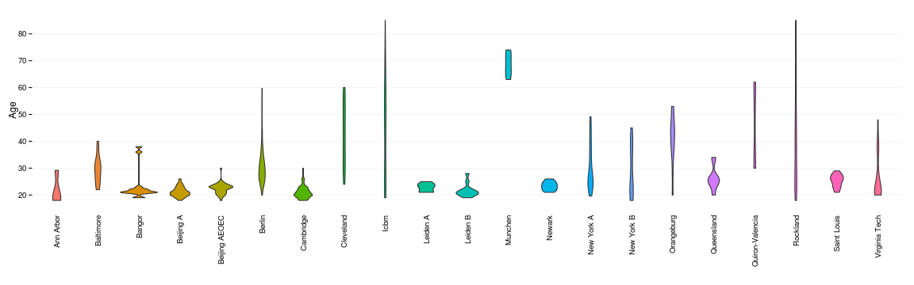
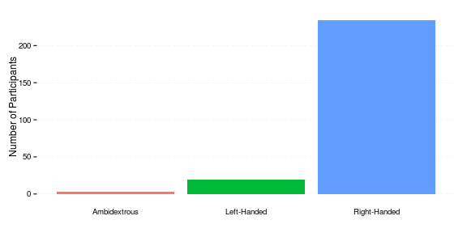
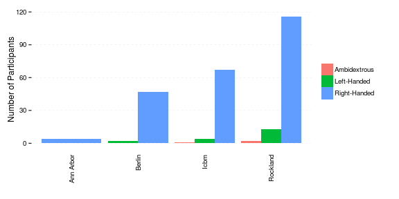
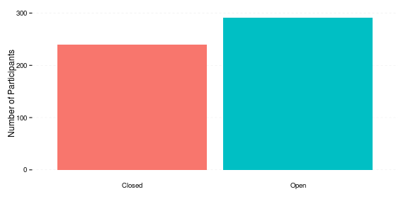
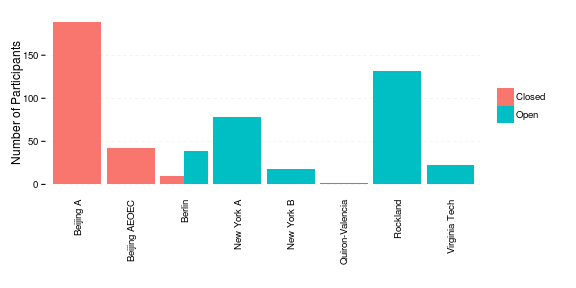

# Overview

This script will visualize the demographics of the discovery and replication samples.

## Setup

The base theme here builds on the `theme_tufte` in the `ggthemes` package.


```r
library(ggplot2)
```

```
## Loading required package: methods
```

```r
library(plyr)

basedir <- "/home/data/Projects/CWAS"
sdir <- file.path(basedir, "share/age+gender/subinfo")

new_df <- read.csv(file.path(sdir, "04_all_df.csv"))

mytheme <- theme_bw() + theme(legend.background = element_blank(), legend.key = element_blank(), 
    panel.background = element_blank(), panel.border = element_blank(), strip.background = element_blank(), 
    plot.background = element_blank(), axis.line = element_blank(), panel.grid.minor = element_blank())
```


## Site Summary

Here is the breakdown of the N for each site.


```r
p <- ggplot(new_df, aes(x = site, y = ..count..)) + geom_bar() + xlab("") + 
    ylim(0, 200) + ylab("Number of Participants") + mytheme
p + theme(axis.text.x = element_text(angle = 90, vjust = 0.5, hjust = 1), panel.grid.major.y = element_line(color = "grey90", 
    linetype = "dashed"), panel.grid.major.x = element_blank(), axis.ticks.x = element_blank())
```

 


```r
ddply(new_df, .(site), function(x) {
    dn <- sum(x$sample == "Discovery Sample")
    rn <- sum(x$sample == "Replication Sample")
    c(Discovery.N = dn, Replication.N = rn, Difference.N = dn - rn)
})
```

```
##               site Discovery.N Replication.N Difference.N
## 1        Ann Arbor           2             2            0
## 2        Baltimore           7             7            0
## 3           Bangor           7             7            0
## 4        Beijing A          94            94            0
## 5    Beijing AEOEC          21            21            0
## 6           Berlin          37            37            0
## 7        Cambridge          92            92            0
## 8        Cleveland          12            12            0
## 9             Icbm          36            36            0
## 10        Leiden A           4             4            0
## 11        Leiden B           6             6            0
## 12         Munchen           3             3            0
## 13          Newark           4             4            0
## 14      New York A          39            39            0
## 15      New York B           9             9            0
## 16      Orangeburg           6             6            0
## 17      Queensland           8             8            0
## 18 Quiron-Valencia           1             1            0
## 19        Rockland          66            66            0
## 20     Saint Louis          13            13            0
## 21   Virginia Tech          11            11            0
```


## Sex

**Across all sites.**


```r
p <- ggplot(new_df, aes(sex, fill = sex)) + geom_bar() + xlab("") + ylab("Number of Participants") + 
    mytheme
p + theme(legend.position = "none", panel.grid.major.y = element_line(color = "grey90", 
    linetype = "dashed"), panel.grid.major.x = element_blank(), axis.ticks.x = element_blank())
```

 


**By Site.**


```r
p <- ggplot(new_df, aes(site, fill = sex)) + geom_bar(position = "dodge") + 
    xlab("") + ylab("Number of Participants") + mytheme
p + theme(legend.title = element_blank(), axis.text.x = element_text(angle = 90, 
    vjust = 0.5, hjust = 1), panel.grid.major.y = element_line(color = "grey90", 
    linetype = "dashed"), panel.grid.major.x = element_blank(), axis.ticks.x = element_blank())
```

 


## Age

**Across all sites.**


```r
new_df$agegroup <- cut(new_df$age, breaks = c(18, seq(20, 80, by = 10), 85), 
    include.lowest = TRUE)
table(new_df$agegroup)
```

```
## 
## [18,20] (20,30] (30,40] (40,50] (50,60] (60,70] (70,80] (80,85] 
##     209     493      96      73      38      27      15       5
```

```r

p <- ggplot(new_df, aes(age, fill = ..count..)) + geom_histogram(binwidth = 2) + 
    xlab("Age") + ylab("Number of Participants") + scale_y_continuous(limits = c(0, 
    250), expand = c(0, 0)) + scale_x_continuous(breaks = seq(20, 80, by = 20), 
    expand = c(0, 0)) + mytheme
p + theme(legend.position = "none", panel.grid.minor.y = element_line(colour = "grey98", 
    size = 0.5), panel.grid.major.x = element_blank())
```

 


**By Site.**
ddply(new_df, .(site), function(x) c(table(x$agegroup)))


```r
ddply(h_new_df, .(site), function(x) table(x$handedness))
```

```
## Error: object 'h_new_df' not found
```

```r

p <- ggplot(new_df, aes(site, age)) + geom_violin(aes(fill = site)) + xlab("") + 
    ylab("Age") + scale_y_continuous(breaks = seq(20, 80, by = 10)) + mytheme
p + theme(axis.text.x = element_text(angle = 90, vjust = 0.5, hjust = 1), axis.ticks.x = element_blank(), 
    legend.position = "none", panel.grid.minor.y = element_line(colour = "grey98", 
        size = 0.5), panel.grid.major.x = element_blank())
```

 


## Handedness

Note the samples (discovery vs replication) are not necessarily split evenly based on handedness. Also this dimension isn't present in all sites.

**Across all sites.**


```r
h_new_df <- subset(new_df, !is.na(handedness))

table(h_new_df$handedness)
```

```
## 
## Ambidextrous  Left-Handed Right-Handed 
##            3           19          234
```

```r

p <- ggplot(h_new_df, aes(handedness, fill = handedness)) + geom_bar() + xlab("") + 
    ylab("Number of Participants") + mytheme
p + theme(legend.position = "none", panel.grid.major.y = element_line(color = "grey90", 
    linetype = "dashed"), panel.grid.major.x = element_blank(), axis.ticks.x = element_blank())
```

 


**By Site.**


```r
ddply(h_new_df, .(site), function(x) table(x$handedness))
```

```
##        site Ambidextrous Left-Handed Right-Handed
## 1 Ann Arbor            0           0            4
## 2    Berlin            0           2           47
## 3      Icbm            1           4           67
## 4  Rockland            2          13          116
```

```r

p <- ggplot(h_new_df, aes(site, fill = handedness)) + geom_bar(position = "dodge") + 
    xlab("") + ylab("Number of Participants") + mytheme
p + theme(legend.title = element_blank(), axis.text.x = element_text(angle = 90, 
    vjust = 0.5, hjust = 1), panel.grid.major.y = element_line(color = "grey90", 
    linetype = "dashed"), panel.grid.major.x = element_blank(), axis.ticks.x = element_blank())
```

 


## Eyes (Open or Closed)

Note the samples (discovery vs replication) are not necessarily split evenly based on eye status. Also this dimension isn't present in all sites.

**Across all sites.**


```r
e_new_df <- subset(new_df, !is.na(eyes))

table(e_new_df$eyes)
```

```
## 
## Closed   Open 
##    240    291
```

```r

p <- ggplot(e_new_df, aes(eyes, fill = eyes)) + geom_bar() + xlab("") + ylab("Number of Participants") + 
    mytheme
p + theme(legend.position = "none", panel.grid.major.y = element_line(color = "grey90", 
    linetype = "dashed"), panel.grid.major.x = element_blank(), axis.ticks.x = element_blank())
```

 


**By Site.**


```r
ddply(e_new_df, .(site), function(x) table(x$eyes))
```

```
##              site Closed Open
## 1       Beijing A    188    0
## 2   Beijing AEOEC     42    0
## 3          Berlin     10   39
## 4      New York A      0   78
## 5      New York B      0   18
## 6 Quiron-Valencia      0    2
## 7        Rockland      0  132
## 8   Virginia Tech      0   22
```

```r

p <- ggplot(e_new_df, aes(site, fill = eyes)) + geom_bar(position = "dodge") + 
    xlab("") + ylab("Number of Participants") + mytheme
p + theme(legend.title = element_blank(), axis.text.x = element_text(angle = 90, 
    vjust = 0.5, hjust = 1), panel.grid.major.y = element_line(color = "grey90", 
    linetype = "dashed"), panel.grid.major.x = element_blank(), axis.ticks.x = element_blank())
```

 

