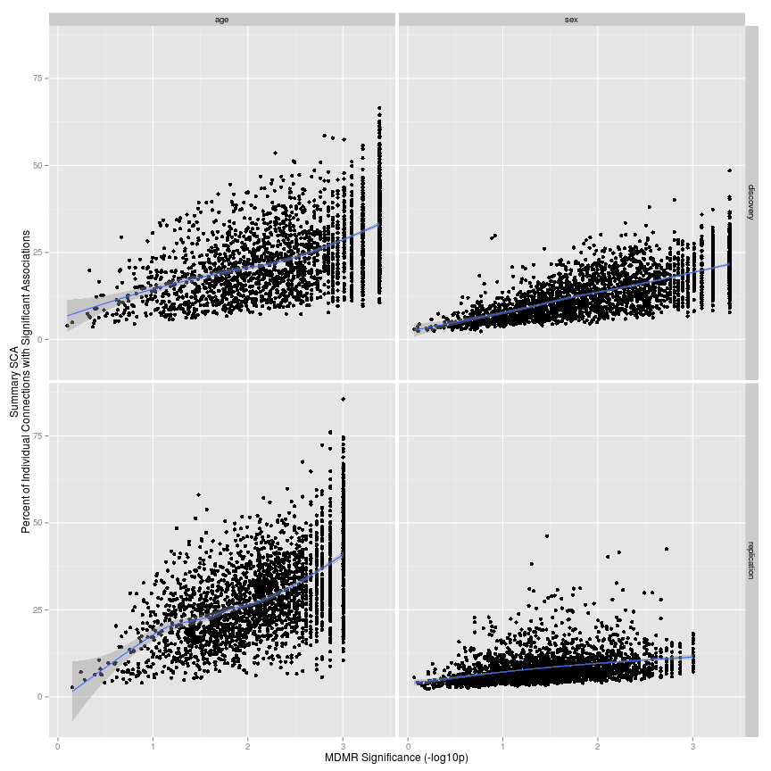
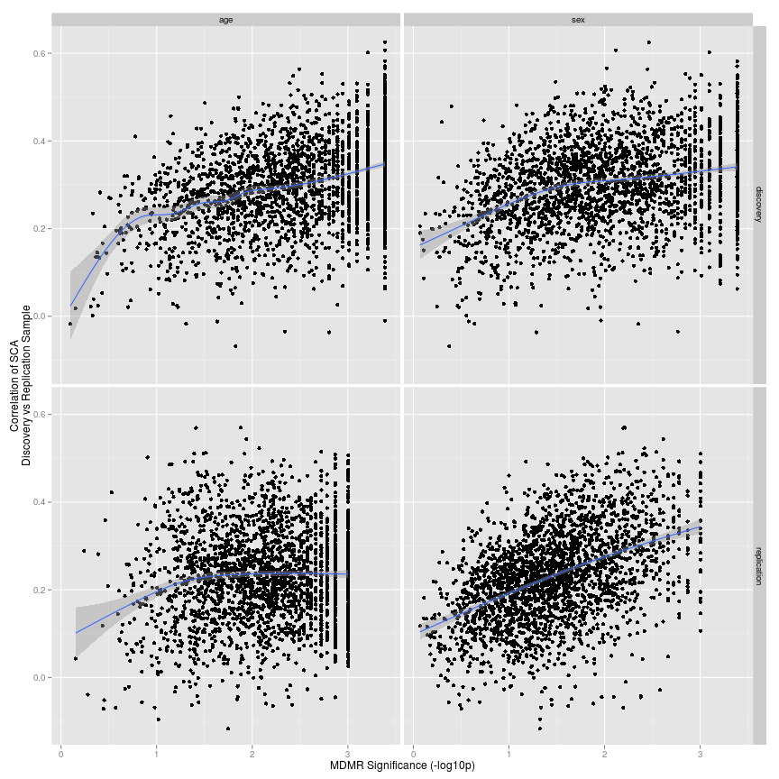

# Compare GLM to MDMR

Here, we will examine how well results from MDMR reflect a simplified representation of running a multiple regression at each connection. In other words, how similar is our multivariate analysis to a more standard univariate analysis. The answer, very similar!

## Setup


```r
library(plyr)
library(reshape)
```

```
## Attaching package: 'reshape'
```

```
## The following object(s) are masked from 'package:plyr':
## 
## rename, round_any
```

```r
library(ggplot2)
```

```
## Loading required package: methods
```


Load functions that calculate dice. Use cor for pearson and kendall_ref for kendalls W.


```r
source("E-10_Results-similarity-functions.R")
```


The df_file contains the columns: sample, factor, roi, mdmr, glm.wt, glm.uwt, and consistency. Basically, it is everything I will need for later. Some notes:

* sample: discovery and replication
* factor: age and sex
* roi: 3200 parcellations
* glm.wt: for each ROI, the sum of all the t-stats relating connectivity strength to a factor (age or sex)
* glm.uwt: for each ROI, the % of connections significantly related to a factor (age or sex)
* consistency: for each ROI, the consistency (spearmans rho) between discovery and replication t-stats relativing connectivity strength related to a factor (age or sex)


```r
basedir <- "/home2/data/Projects/CWAS"
datadir <- file.path(basedir, "age+gender/04_compare_to_glm")
df_file <- file.path(datadir, "comparison/01_dataframe_glm+mdmr.csv")
```


The base theme here builds on the `theme_tufte` in the `ggthemes` package.


```r
mytheme <- theme_bw() + theme(legend.background = element_blank(), legend.key = element_blank(), 
    panel.background = element_blank(), panel.border = element_blank(), strip.background = element_blank(), 
    plot.background = element_blank(), axis.line = element_blank(), panel.grid.minor = element_blank())
```


## Inputs


```r
df <- read.csv(df_file)
```


## MDMR vs GLM

I take the correlation between the MDMR and summary GLM values.


```r
tab <- ddply(df, .(sample, factor), function(sdf) {
    c(r = cor(sdf$mdmr, sdf$glm.uwt, method = "s"))
})
print(tab)
```

```
##        sample factor      r
## 1   discovery    age 0.5699
## 2   discovery    sex 0.7296
## 3 replication    age 0.5540
## 4 replication    sex 0.4484
```


```r
ggplot(df, aes(mdmr, glm.uwt)) + geom_point() + geom_smooth() + facet_grid(sample ~ 
    factor) + xlab("MDMR Significance (-log10p)") + ylab("Summary SCA\nPercent of Individual Connections with Significant Associations")
```

```
## geom_smooth: method="auto" and size of largest group is >=1000, so using
## gam with formula: y ~ s(x, bs = "cs"). Use 'method = x' to change the
## smoothing method.
```

```
## geom_smooth: method="auto" and size of largest group is >=1000, so using
## gam with formula: y ~ s(x, bs = "cs"). Use 'method = x' to change the
## smoothing method.
```

```
## geom_smooth: method="auto" and size of largest group is >=1000, so using
## gam with formula: y ~ s(x, bs = "cs"). Use 'method = x' to change the
## smoothing method.
```

```
## geom_smooth: method="auto" and size of largest group is >=1000, so using
## gam with formula: y ~ s(x, bs = "cs"). Use 'method = x' to change the
## smoothing method.
```

 

```r
# mytheme
```


## MDMR vs GLM Consistency


```r
tab <- ddply(df, .(sample, factor), function(sdf) {
    c(r = cor(sdf$mdmr, sdf$consistency, method = "s"))
})
print(tab)
```

```
##        sample factor       r
## 1   discovery    age 0.36916
## 2   discovery    sex 0.30157
## 3 replication    age 0.06293
## 4 replication    sex 0.46126
```


```r
ggplot(df, aes(mdmr, consistency)) + geom_point() + geom_smooth() + facet_grid(sample ~ 
    factor) + xlab("MDMR Significance (-log10p)") + ylab("Correlation of SCA\nDiscovery vs Replication Sample")
```

```
## geom_smooth: method="auto" and size of largest group is >=1000, so using
## gam with formula: y ~ s(x, bs = "cs"). Use 'method = x' to change the
## smoothing method.
```

```
## geom_smooth: method="auto" and size of largest group is >=1000, so using
## gam with formula: y ~ s(x, bs = "cs"). Use 'method = x' to change the
## smoothing method.
```

```
## geom_smooth: method="auto" and size of largest group is >=1000, so using
## gam with formula: y ~ s(x, bs = "cs"). Use 'method = x' to change the
## smoothing method.
```

```
## geom_smooth: method="auto" and size of largest group is >=1000, so using
## gam with formula: y ~ s(x, bs = "cs"). Use 'method = x' to change the
## smoothing method.
```

 

```r
# mytheme
```

