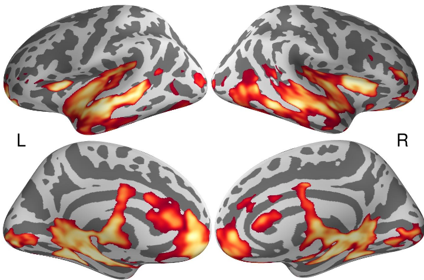
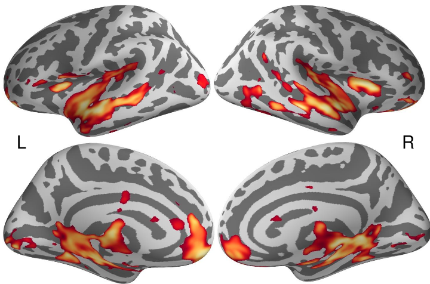
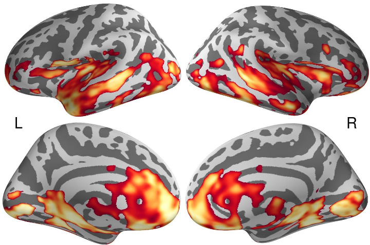
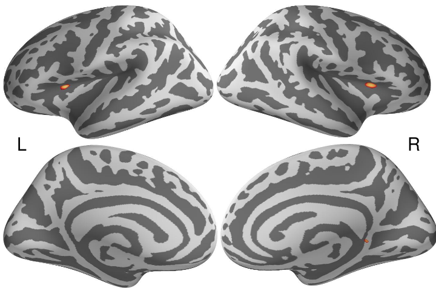
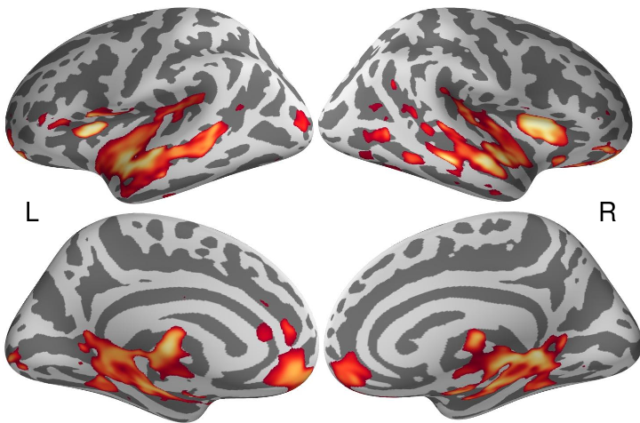
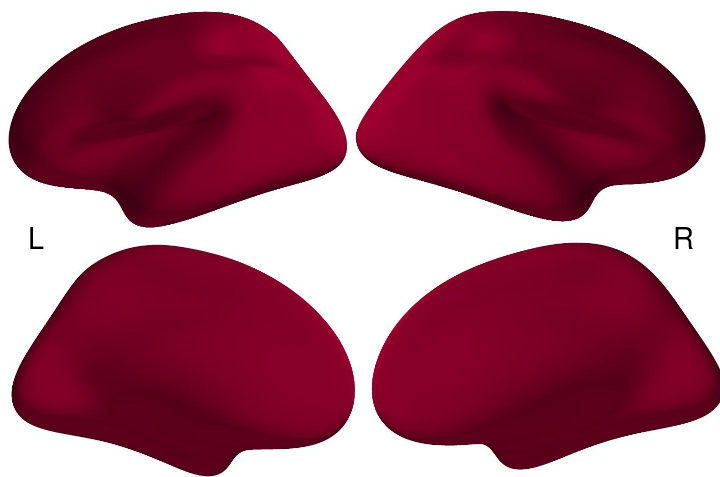

# Development + Motion with Power Dataset

## Setup


```r
library(jpeg)
source("40_montage_functions.R")
```


```r
basedir <- "/home2/data/Projects/CWAS"
vizdir <- file.path(basedir, "development+motion/viz")
setwd(vizdir)
```


## Surface Maps

Below are the inflated surface maps for different development and motion CWAS. Here we used 3200 parcellations and for each parcellation, we examined how its voxelwise connectivity with the rest of the brain varied between subjects for age and if included mean FD.

There were two kinds of CWAS. In the 'standard' approach, we had two types of models that either included or did not include mean FD as a regressor. Both models had age and included the following covariates: sex and TR. We were looking to examine the effects of including motion in the model, in particular on age effects. In the 'alternative' approach, we were also looking at the effects of motion on our effects but we regressed out mean FD prior to calculating CWAS with a standard GLM. That is, at every connection the effect of motion (mean FD) was removed using GLM.

### Standard CWAS

In the 'standard' approach, we had two types of models that either included or did not include mean FD as a regressor. Both models had age and included the following covariates: sex and TR. We were looking to examine the effects of including motion in the model, in particular on age effects.

#### Only Age


```r
# Load the images
filenames <- list.files(path = vizdir, full.names = T, pattern = "zpics_surface_only_age_[lr]h_(med|lat)")
images <- lapply(filenames, readJPEG)

# Coordinates
coords <- surfer_montage_coords(images)

# Dimensions of image
dims <- surfer_montage_dims(coords)
```


```r
# Visualize
invisible(surfer_montage_viz(images, coords))
```

 


#### Age with motion

Including motion as a covariate, reduces the extent of significant associations.


```r
# Load the images
filenames <- list.files(path = vizdir, full.names = T, pattern = "zpics_surface_age_with_motion_[lr]h_(med|lat)")
images <- lapply(filenames, readJPEG)

# Coordinates
coords <- surfer_montage_coords(images)

# Dimensions of image
dims <- surfer_montage_dims(coords)
```


```r
# Visualize
invisible(surfer_montage_viz(images, coords))
```

 


#### Motion with age

Many significant age associations appear overlap with associations related to motion.


```r
# Load the images
filenames <- list.files(path = vizdir, full.names = T, pattern = "zpics_surface_motion_with_age_[lr]h_(med|lat)")
images <- lapply(filenames, readJPEG)

# Coordinates
coords <- surfer_montage_coords(images)

# Dimensions of image
dims <- surfer_montage_dims(coords)
```


```r
# Visualize
invisible(surfer_montage_viz(images, coords))
```

 


### CWAS with Regressing Motion with GLM

In the 'alternative' approach, we were also looking at the effects of motion on our effects but we regressed out mean FD prior to calculating CWAS with a standard GLM. That is, at every connection the effect of motion (mean FD) was removed using GLM and then the CWAS related to age including covariates of sex and TR was computed.

#### Only Age

It is very strange that nothing results here.


```r
# Load the images
filenames <- list.files(path = vizdir, full.names = T, pattern = "zpics_glm_regress_surface_only_age_[lr]h_(med|lat)")
images <- lapply(filenames, readJPEG)

# Coordinates
coords <- surfer_montage_coords(images)

# Dimensions of image
dims <- surfer_montage_dims(coords)
```


```r
# Visualize
invisible(surfer_montage_viz(images, coords))
```

 


#### Age with motion

I am not sure if it was appropriate to include motion (mean FD) as a regressor, but it is strange that this leads to more significant results for age then above.


```r
# Load the images
filenames <- list.files(path = vizdir, full.names = T, pattern = "zpics_glm_regress_surface_age_with_motion_[lr]h_(med|lat)")
images <- lapply(filenames, readJPEG)

# Coordinates
coords <- surfer_montage_coords(images)

# Dimensions of image
dims <- surfer_montage_dims(coords)
```


```r
# Visualize
invisible(surfer_montage_viz(images, coords))
```

 


#### Motion with age

Is it because the motion regressor, which produces null results, screws up the model?


```r
# Load the images
filenames <- list.files(path = vizdir, full.names = T, pattern = "zpics_glm_regress_surface_motion_with_age_[lr]h_(med|lat)")
images <- lapply(filenames, readJPEG)

# Coordinates
coords <- surfer_montage_coords(images)

# Dimensions of image
dims <- surfer_montage_dims(coords)
```


```r
# Visualize
invisible(surfer_montage_viz(images, coords))
```

 

