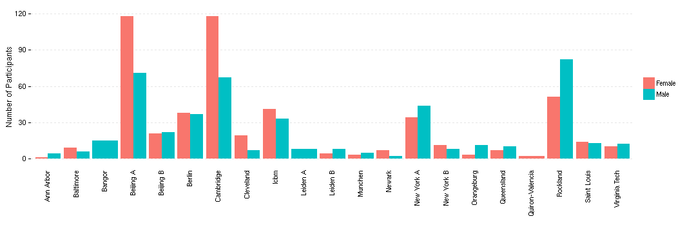
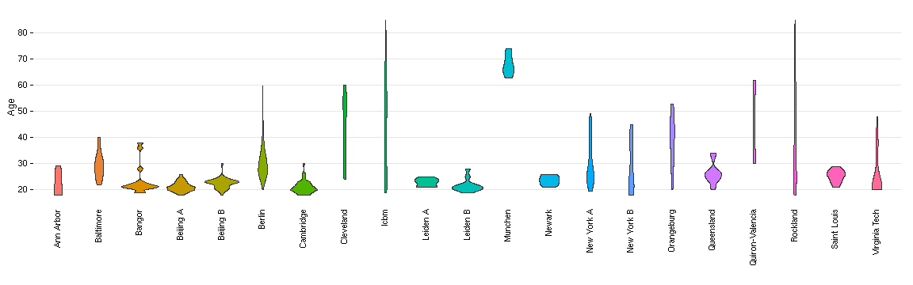
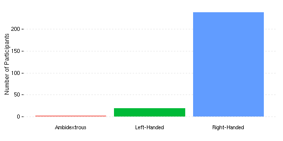
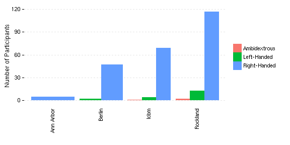
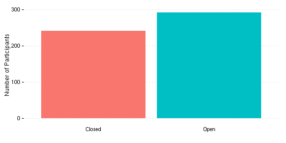

# Overview

This script will split the subjects's into 2 equal groups.

## Setup

The base theme here builds on the `theme_tufte` in the `ggthemes` package.


```r
library(ggplot2)
```

```
## Loading required package: methods
```

```r
library(plyr)

basedir <- "/home/data/Projects/CWAS"

df <- read.csv(file.path(basedir, "share/subinfo/03_details.csv"))

mytheme <- theme_bw() + theme(legend.background = element_blank(), legend.key = element_blank(), 
    panel.background = element_blank(), panel.border = element_blank(), strip.background = element_blank(), 
    plot.background = element_blank(), axis.line = element_blank(), panel.grid.minor = element_blank())
```


I have fixed up the site labels here to be more pretty as well as various other labels...proly should have done this earlier.

**TODO**
* Collapsing New York A + New York A ADHD together...check if this is kosher
* Check that Saint Louis is true rest


```r
source("/home/data/Projects/CWAS/share/lib/capitalize.R")  ## capitalize and titalize functions

## Site
site <- as.character(df$site)
site <- gsub("_", " ", site)
site <- titalize(site)
site <- gsub("Ann Arbor A", "Ann Arbor", site)
site <- gsub("Beijing$", "Beijing A", site)
site <- gsub("BeijingEOEC", "Beijing B", site)
site <- gsub("New York A Adhd", "New York A", site)  # collapsing New York A here...check if ok
site <- gsub("QuironValencia", "Quiron-Valencia", site)
site <- gsub("SaintLouis", "Saint Louis", site)
site <- gsub("VirginiaTech", "Virginia Tech", site)
df$orig_site <- df$site
df$site <- factor(site)

## Sex
sex <- as.character(df$sex)
sex <- gsub("M", "Male", sex)
sex <- gsub("F", "Female", sex)
df$sex <- factor(sex)

## Eyes
eyes <- capitalize(df$eyes)
eyes[eyes == ""] <- NA
eyes[df$site == "Rockland"] <- "Open"
eyes[grep("New York", df$site)] <- "Open"
df$eyes <- factor(eyes)

## Handedness
handedness <- as.character(df$handedness)
handedness <- gsub("A", "Ambidextrous", handedness)
handedness <- gsub("L", "Left-Handed", handedness)
handedness <- gsub("R", "Right-Handed", handedness)
handedness[handedness == ""] <- NA
df$handedness <- factor(handedness)

## Run
run <- as.numeric(df$run)
run <- factor(run, labels = c("Run 1", "Run 2", "Run 3"))
df$run <- run

## Save
write.csv(df, file = "/home/data/Projects/CWAS/share/subinfo/03_details_touse.csv", 
    row.names = F)
```


## Split Groups


```r
df <- cbind(index = 1:nrow(df), df)  # add index in case want to easily go backwards
new_df <- ddply(df, .(site, sex), function(sdf) {
    sdf <- sdf[order(sdf$age), ]
    n <- nrow(sdf)
    labels <- c("Discovery Sample", "Replication Sample")
    sdf$sample <- rep(sample(labels), length.out = n)
    for (i in seq(1, n, by = 2)) {
        if (n < (i + 1)) 
            next
        sdf$sample[i:(i + 1)] <- sample(sdf$sample[i:(i + 1)])
    }
    sdf
})
```


Save two different data frames and functional file paths.


```r
df.discovery <- subset(new_df, new_df$sample == "Discovery Sample")
func.discovery <- file.path(df.discovery$outdir, "func/bandpass_freqs_0.01.0.1/functional_mni.nii.gz")
write.csv(df.discovery, file = file.path(basedir, "share/subinfo/04_discovery_df.csv"), 
    row.names = F)
write.table(func.discovery, file = file.path(basedir, "share/subinfo/04_discovery_funcpaths.txt"), 
    row.names = F, col.names = F)

df.replication <- subset(new_df, new_df$sample == "Replication Sample")
func.replication <- file.path(df.replication$outdir, "func/bandpass_freqs_0.01.0.1/functional_mni.nii.gz")
write.csv(df.replication, file = file.path(basedir, "share/subinfo/04_replication_df.csv"), 
    row.names = F)
write.table(func.replication, file = file.path(basedir, "share/subinfo/04_replication_funcpaths.txt"), 
    row.names = F, col.names = F)
```


## Site Summary

Here is the breakdown of the N for each site.


```r
p <- ggplot(new_df, aes(x = site, y = ..count..)) + geom_bar() + xlab("") + 
    ylim(0, 200) + ylab("Number of Participants") + mytheme
p + theme(axis.text.x = element_text(angle = 90, vjust = 0.5, hjust = 1), panel.grid.major.y = element_line(color = "grey90", 
    linetype = "dashed"), panel.grid.major.x = element_blank(), axis.ticks.x = element_blank())
```

 


```r
ddply(new_df, .(site), function(x) {
    dn <- sum(x$sample == "Discovery Sample")
    rn <- sum(x$sample == "Replication Sample")
    c(Discovery.N = dn, Replication.N = rn, Difference.N = dn - rn)
})
```

```
##               site Discovery.N Replication.N Difference.N
## 1        Ann Arbor           3             2            1
## 2        Baltimore           7             8           -1
## 3           Bangor           7             8           -1
## 4        Beijing A          95            94            1
## 5        Beijing B          22            21            1
## 6           Berlin          38            37            1
## 7        Cambridge          93            92            1
## 8        Cleveland          14            12            2
## 9             Icbm          38            36            2
## 10        Leiden A           4             4            0
## 11        Leiden B           6             6            0
## 12         Munchen           4             4            0
## 13          Newark           4             5           -1
## 14      New York A          39            39            0
## 15      New York B          10             9            1
## 16      Orangeburg           6             8           -2
## 17      Queensland           9             8            1
## 18 Quiron-Valencia           1             1            0
## 19        Rockland          67            66            1
## 20     Saint Louis          13            14           -1
## 21   Virginia Tech          11            11            0
```


## Sex

**Across all sites.**


```r
p <- ggplot(new_df, aes(sex, fill = sex)) + geom_bar() + xlab("") + ylab("Number of Participants") + 
    mytheme
p + theme(legend.position = "none", panel.grid.major.y = element_line(color = "grey90", 
    linetype = "dashed"), panel.grid.major.x = element_blank(), axis.ticks.x = element_blank())
```

 


**By Site.**


```r
p <- ggplot(new_df, aes(site, fill = sex)) + geom_bar(position = "dodge") + 
    xlab("") + ylab("Number of Participants") + mytheme
p + theme(legend.title = element_blank(), axis.text.x = element_text(angle = 90, 
    vjust = 0.5, hjust = 1), panel.grid.major.y = element_line(color = "grey90", 
    linetype = "dashed"), panel.grid.major.x = element_blank(), axis.ticks.x = element_blank())
```

 


## Age

**Across all sites.**


```r
new_df$agegroup <- cut(new_df$age, breaks = c(18, seq(20, 80, by = 10), 85), 
    include.lowest = TRUE)
table(new_df$agegroup)
```

```
## 
## [18,20] (20,30] (30,40] (40,50] (50,60] (60,70] (70,80] (80,85] 
##     210     507      97      73      40      29      15       5
```

```r

p <- ggplot(new_df, aes(age, fill = ..count..)) + geom_histogram(binwidth = 2) + 
    xlab("Age") + ylab("Number of Participants") + scale_y_continuous(limits = c(0, 
    250), expand = c(0, 0)) + scale_x_continuous(breaks = seq(20, 80, by = 20), 
    expand = c(0, 0)) + mytheme
p + theme(legend.position = "none", panel.grid.minor.y = element_line(colour = "grey98", 
    size = 0.5), panel.grid.major.x = element_blank())
```

 


**By Site.**
ddply(new_df, .(site), function(x) c(table(x$agegroup)))


```r
ddply(h_new_df, .(site), function(x) table(x$handedness))
```

```
## Error: object 'h_new_df' not found
```

```r

p <- ggplot(new_df, aes(site, age)) + geom_violin(aes(fill = site)) + xlab("") + 
    ylab("Age") + scale_y_continuous(breaks = seq(20, 80, by = 10)) + mytheme
p + theme(axis.text.x = element_text(angle = 90, vjust = 0.5, hjust = 1), axis.ticks.x = element_blank(), 
    legend.position = "none", panel.grid.minor.y = element_line(colour = "grey98", 
        size = 0.5), panel.grid.major.x = element_blank())
```

 


## Handedness

Note the samples (discovery vs replication) are not necessarily split evenly based on handedness. Also this dimension isn't present in all sites.

**Across all sites.**


```r
h_new_df <- subset(new_df, !is.na(handedness))

table(h_new_df$handedness)
```

```
## 
## Ambidextrous  Left-Handed Right-Handed 
##            3           19          238
```

```r

p <- ggplot(h_new_df, aes(handedness, fill = handedness)) + geom_bar() + xlab("") + 
    ylab("Number of Participants") + mytheme
p + theme(legend.position = "none", panel.grid.major.y = element_line(color = "grey90", 
    linetype = "dashed"), panel.grid.major.x = element_blank(), axis.ticks.x = element_blank())
```

 


**By Site.**


```r
ddply(h_new_df, .(site), function(x) table(x$handedness))
```

```
##        site Ambidextrous Left-Handed Right-Handed
## 1 Ann Arbor            0           0            5
## 2    Berlin            0           2           47
## 3      Icbm            1           4           69
## 4  Rockland            2          13          117
```

```r

p <- ggplot(h_new_df, aes(site, fill = handedness)) + geom_bar(position = "dodge") + 
    xlab("") + ylab("Number of Participants") + mytheme
p + theme(legend.title = element_blank(), axis.text.x = element_text(angle = 90, 
    vjust = 0.5, hjust = 1), panel.grid.major.y = element_line(color = "grey90", 
    linetype = "dashed"), panel.grid.major.x = element_blank(), axis.ticks.x = element_blank())
```

 


## Eyes (Open or Closed)

Note the samples (discovery vs replication) are not necessarily split evenly based on eye status. Also this dimension isn't present in all sites.

**Across all sites.**


```r
e_new_df <- subset(new_df, !is.na(eyes))

table(e_new_df$eyes)
```

```
## 
## Closed   Open 
##    242    293
```

```r

p <- ggplot(e_new_df, aes(eyes, fill = eyes)) + geom_bar() + xlab("") + ylab("Number of Participants") + 
    mytheme
p + theme(legend.position = "none", panel.grid.major.y = element_line(color = "grey90", 
    linetype = "dashed"), panel.grid.major.x = element_blank(), axis.ticks.x = element_blank())
```

 


**By Site.**


```r
ddply(e_new_df, .(site), function(x) table(x$eyes))
```

```
##              site Closed Open
## 1       Beijing A    189    0
## 2       Beijing B     43    0
## 3          Berlin     10   39
## 4      New York A      0   78
## 5      New York B      0   19
## 6 Quiron-Valencia      0    2
## 7        Rockland      0  133
## 8   Virginia Tech      0   22
```

```r

p <- ggplot(e_new_df, aes(site, fill = eyes)) + geom_bar(position = "dodge") + 
    xlab("") + ylab("Number of Participants") + mytheme
p + theme(legend.title = element_blank(), axis.text.x = element_text(angle = 90, 
    vjust = 0.5, hjust = 1), panel.grid.major.y = element_line(color = "grey90", 
    linetype = "dashed"), panel.grid.major.x = element_blank(), axis.ticks.x = element_blank())
```

 

