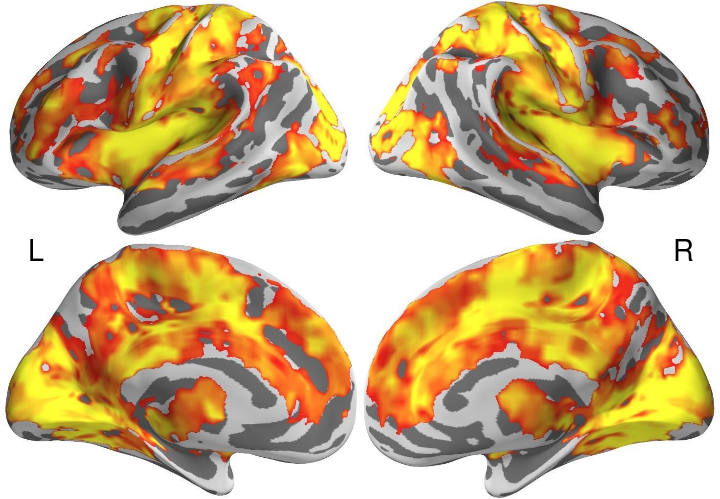
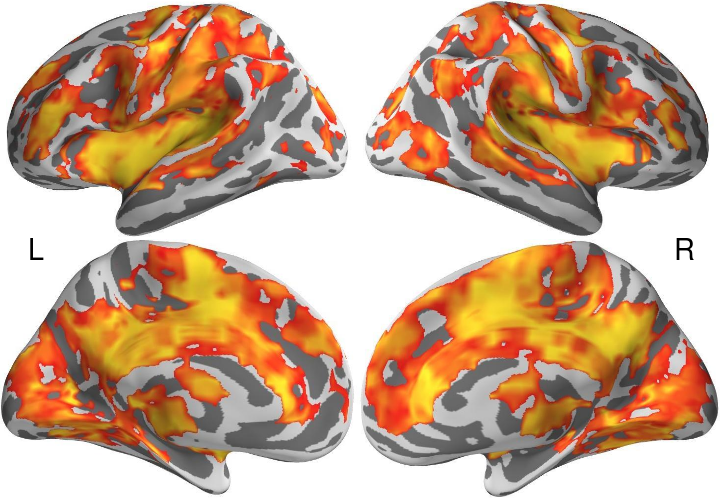
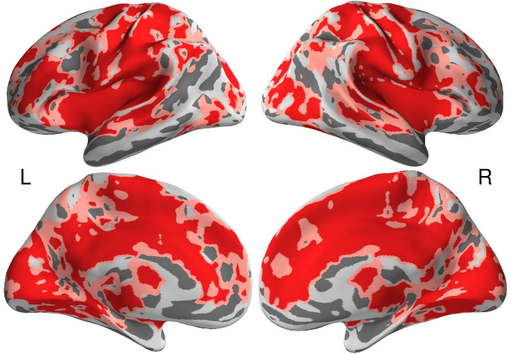

# Age Effects

## Setup


```r
suppressPackageStartupMessages(library(niftir))
suppressPackageStartupMessages(library(ggplot2))
suppressPackageStartupMessages(library(jpeg))
suppressPackageStartupMessages(library(png))
suppressPackageStartupMessages(library(colorspace))
source("E-21_montage_functions.R")
```


```r
basedir <- "/home2/data/Projects/CWAS"
cwasdir <- file.path(basedir, "age+gender/03_robustness/cwas")
vizdir <- file.path(basedir, "age+gender/03_robustness/viz_cwas/pysurfer")
setwd(vizdir)
```


## Overlap

The percent overlap and dice-coefficient between the discovery and replication sample are given for four thresholds, including p < 0.05, 0.01, 0.005, & 0.001.


```r
mask <- read.mask(file.path(cwasdir, "discovery_rois_random_k3200", "mask2.nii.gz"))
discovery.img <- read.nifti.image(file.path(cwasdir, "discovery_rois_random_k3200", 
    "age+gender_15k.mdmr", "fdr_logp_age.nii.gz"))[mask]
replication.img <- read.nifti.image(file.path(cwasdir, "replication_rois_random_k3200", 
    "age+gender_15k.mdmr", "fdr_logp_age.nii.gz"))[mask]
thr_pvals <- c(0.05, 0.01, 0.005, 0.001)
```


### Percent Overlap


```r
fun_overlap <- function(thr) round(sum((discovery.img > thr) & (replication.img > 
    thr))/sum((discovery.img > thr) | (replication.img > thr)), 4) * 100
overlap.df <- data.frame(pvals = thr_pvals, logps = -log10(thr_pvals), overlap = sapply(-log10(thr_pvals), 
    fun_overlap))
print(overlap.df)
```

```
##   pvals logps overlap
## 1 0.050 1.301   90.13
## 2 0.010 2.000   70.47
## 3 0.005 2.301   59.36
## 4 0.001 3.000   28.77
```


### Dice Coefficient


```r
fun_dice <- function(thr) (2 * sum((discovery.img > thr) & (replication.img > 
    thr)))/(sum(discovery.img > thr) + sum(replication.img > thr))
dice.df <- data.frame(pvals = thr_pvals, logps = -log10(thr_pvals), overlap = sapply(-log10(thr_pvals), 
    fun_dice))
print(dice.df)
```

```
##   pvals logps overlap
## 1 0.050 1.301  0.9481
## 2 0.010 2.000  0.8268
## 3 0.005 2.301  0.7450
## 4 0.001 3.000  0.4468
```


### Venn Diagram

These lines get the values to be used in the venn diagram.


```r
venn.vals <- round(table(d = discovery.img > 2, r = replication.img > 2)/12220 * 
    100)
cat(paste(sprintf("discovery: %i\n", sum(venn.vals[2, ])), sprintf("replication: %i\n", 
    sum(venn.vals[, 2])), sprintf("overlap: %i\n", venn.vals[2, 2]), sep = ""))
```

```
## discovery: 88
## replication: 82
## overlap: 70
```


Here, we choose the two colors to be used in the venn diagram.


```r
cols <- rainbow_hcl(4, start = 30, end = 300)[c(2, 4)]
print(cols)
```

```
## [1] "#86B875" "#CD99D8"
```

```r
print(col2rgb(cols))
```

```
##       [,1] [,2]
## red    134  205
## green  184  153
## blue   117  216
```


Finally, we plot the venn diagram using google charts from https://chart.googleapis.com/chart?cht=v&chs=400x400&chd=t:88,82,0,70&chco=86B875,CD99D8. Note that discovery sample is on the right in green while the replication sample is on the left in purple. I have also saved the image in the viz_cwas folder (/home2/data/Projects/CWAS/age+gender/03_robustness) as venn_diagram.png.

</img>

### Similarity (Unthresholded)

Loading up similarity measures calculated with E-11_Summary-similarity.R where the MDMR results from the discovery and replication samples are compared. The similarity measures include kendall's W (rank-based) and pearson correlation. I also computed the dice coefficient at various -log10p levels (1-3 with 0.5 steps), but I won't be showing that here. The loaded values also have results for sex effects, which also won't be shown here.


```r
load(file.path(cwasdir, "similarities_fdr.rda"))  # yup FDR-corrected

cat(paste(sprintf("kendalls W: %.4f\n", list.fdr.kendall[[1]]), sprintf("pearsons r: %.4f\n", 
    list.fdr.pearson[[1]]), sep = ""))
```

```
## kendalls W: 0.7173
## pearsons r: 0.4598
```


## Surface Maps

Below are the inflated surface maps for age effects with site, run, sex, and mean_FD as covariates. More specifically, we used 3200 parcellations and for each parcellation, we examined how its voxelwise connectivity with the rest of the brain varied between subjects for age.

### Discovery Sample


```r
# Load the images
filenames <- list.files(path = vizdir, full.names = T, pattern = "zpics_discovery_age_surface_[lr]h_(med|lat)")
images <- lapply(filenames, readJPEG)

# Coordinates
coords <- surfer_montage_coords(images)

# Dimensions of image
dims <- surfer_montage_dims(coords)
```


The range here is 2 - 3.5 (-log10p).


```r
# Visualize
invisible(surfer_montage_viz(images, coords))
```

 


### Replication Sample


```r
# Load the images
filenames <- list.files(path = vizdir, full.names = T, pattern = "zpics_replication_age_surface_[lr]h_(med|lat)")
images <- lapply(filenames, readJPEG)

# Coordinates
coords <- surfer_montage_coords(images)

# Dimensions of image
dims <- surfer_montage_dims(coords)
```


The range here is 2 - 3.25 (-log10p).


```r
# Visualize
invisible(surfer_montage_viz(images, coords))
```

 


### Color Bar

This is the color bar for the discovery and replication sample results.


```r
colorbar <- readPNG(file.path(dirname(cwasdir), "viz_cwas", "colorbar_red_yellow.png"))
dims <- plot_rasterimage_dims(colorbar)
```


```r
plot_rasterimage_viz(colorbar, dims)
```

 


### Overlap


```r
# Load the images
filenames <- list.files(path = vizdir, full.names = T, pattern = "zpics_overlap_age_surface_[lr]h_(med|lat)")
images <- lapply(filenames, readJPEG)

# Coordinates
coords <- surfer_montage_coords(images)

# Dimensions of image
dims <- surfer_montage_dims(coords)
```


```r
# Visualize
invisible(surfer_montage_viz(images, coords))
```

 

