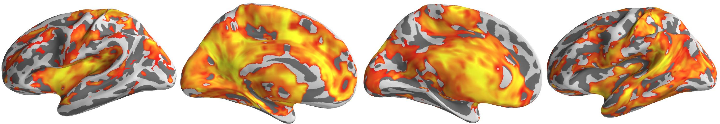
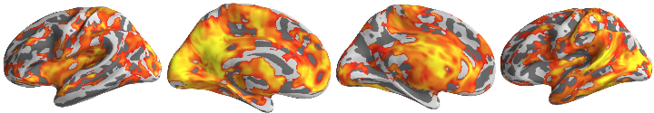
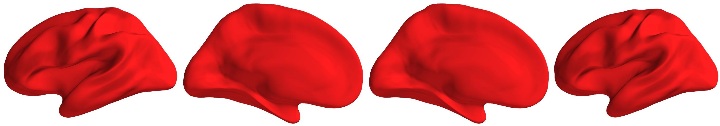

# Development + Motion with Power Dataset

## Setup


```r
library(jpeg)
source("40_montage_functions.R")
```


```r
basedir <- "/home2/data/Projects/CWAS"
vizdir <- file.path(basedir, "adhd200/viz")
setwd(vizdir)
```


## Surface Maps

Below are the inflated surface maps for the ADHD200 nyc sample CWAS. Here we used 3200 parcellations and for each parcellation, we examined how its voxelwise connectivity with the rest of the brain varied between subjects for age and if included mean FD.

### ADHD-C vs ADHD-I


```r
# Load the images
filenames.lh <- list.files(path = vizdir, full.names = T, pattern = "zpics_surface_adhdc_vs_adhdi_lh_(med|lat)")
filenames.rh <- list.files(path = vizdir, full.names = T, pattern = "zpics_surface_adhdc_vs_adhdi_rh_(med|lat)")
filenames <- c(filenames.lh, rev(filenames.rh))
images <- lapply(filenames, readJPEG)

# Coordinates
coords <- surfer_montage_coords(images, 1, 4)

# Dimensions
dims <- surfer_montage_dims(coords)
```


```r
# Visualize
invisible(surfer_montage_viz(images, coords))
```

 


### TDC vs ADHD-I


```r
# Load the images
filenames.lh <- list.files(path = vizdir, full.names = T, pattern = "zpics_surface_tdc_vs_adhdi_lh_(med|lat)")
filenames.rh <- list.files(path = vizdir, full.names = T, pattern = "zpics_surface_tdc_vs_adhdi_rh_(med|lat)")
filenames <- c(filenames.lh, rev(filenames.rh))
images <- lapply(filenames, readJPEG)

# Coordinates
coords <- surfer_montage_coords(images, 1, 4)

# Dimensions
dims <- surfer_montage_dims(coords)
```


```r
# Visualize
invisible(surfer_montage_viz(images, coords))
```

 


### TDC vs ADHD-C


```r
# Load the images
filenames.lh <- list.files(path = vizdir, full.names = T, pattern = "zpics_surface_tdc_vs_adhdc_lh_(med|lat)")
filenames.rh <- list.files(path = vizdir, full.names = T, pattern = "zpics_surface_tdc_vs_adhdc_rh_(med|lat)")
filenames <- c(filenames.lh, rev(filenames.rh))
images <- lapply(filenames, readJPEG)

# Coordinates
coords <- surfer_montage_coords(images, 1, 4)

# Dimensions
dims <- surfer_montage_dims(coords)
```


```r
# Visualize
invisible(surfer_montage_viz(images, coords))
```

 

