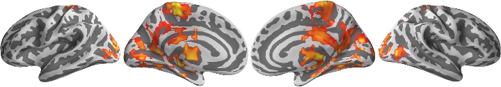

# L-DOPA Pharmacological Manipulation

Examining the effects on connectivity after taking L-DOPA versus placebo.

## Setup


```r
library(jpeg)
source("40_montage_functions.R")
```


```r
basedir <- "/home2/data/Projects/CWAS"
datadir <- file.path(basedir, "ldopa/cwas")
vizdir <- file.path(basedir, "ldopa/viz")
```


## Surface Maps


```r
setwd(vizdir)

# Load the images
filenames.lh <- list.files(path = vizdir, full.names = T, pattern = "zpics_surface_lh_(med|lat)")
filenames.rh <- list.files(path = vizdir, full.names = T, pattern = "zpics_surface_rh_(med|lat)")
filenames <- c(filenames.lh, rev(filenames.rh))
images <- lapply(filenames, readJPEG)

# Coordinates
coords <- surfer_montage_coords(images)

# Dimensions of image
dims <- surfer_montage_dims(coords)
```


Below are the inflated surface maps for the L-DOPA CWAS. Here we used 3200 parcellations and for each parcellations examined how its voxelwise connectivity with the rest of the brain varied within subjects for L-DOPA versus placebo.


```r
# Visualize
invisible(surfer_montage_viz(images, coords))
```

 

